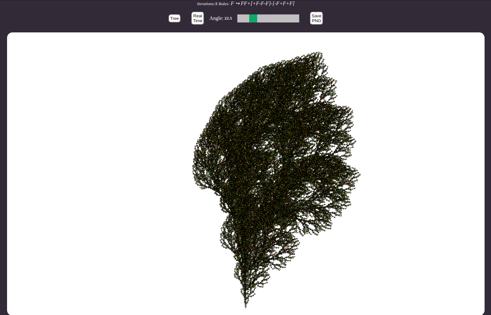

# L-System

This project implements a simple example of L-system.
 
## How to use :scroll:

- Just open the path of [index.html](./src/index.html) in your browser.

>The function that `generates the string` based on alphabet of symbols and the rule <strong>F &#8618; FF+[+F-F-F]-[-F+F+F]</strong> is implemented in [this function](https://github.com/iamseki/L-system-gen/blob/master/src/javascript/draw.js#L47)

## What expect from Index.html :camera:

 

---

### Considerations :grimacing:

There are some responsive issues with the canvas manipuled by `P5js` library which is used to draw the weird string generated by L-System. 

I hope to solve this someday :sweat_smile:

